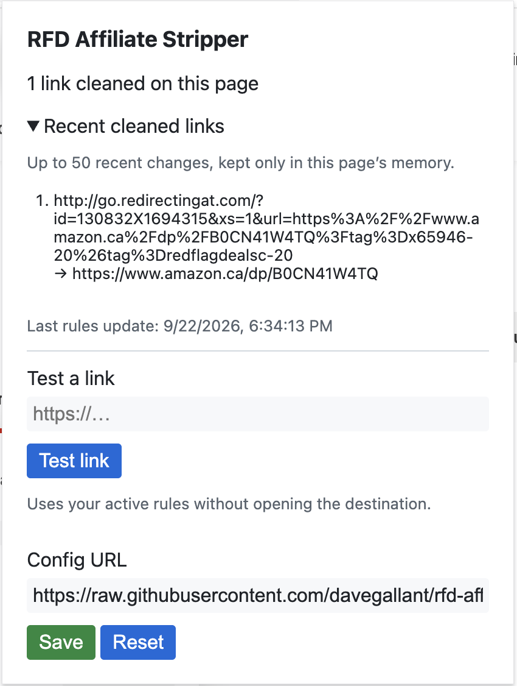

# RFD Enhancement Suite

Give [RedFlagDeals forums](https://forums.redflagdeals.com/) a calmer interface for Hot Deals lists and discussion threads, while cleaning supported affiliate redirects and tracking parameters from deal links. Modern view is on by default and can be turned off in the popup or with **Original view** on the page. Link cleaning remains active when appearance is off.

[Install for Firefox](https://addons.mozilla.org/en-US/firefox/addon/rfd-redirect-stripper/) · [Install for Chrome](https://chromewebstore.google.com/detail/rfd-affiliate-stripper/nhjomcijhonhoggkckbjjfnjdcefbblo)



## Appearance

Modern view applies to supported deal card listings and discussion threads. It uses the full page width and hides the sidebar on both pages by default. The popup's **Hide sidebar** switch restores it when turned off. The view preserves the forum's native links, filters, pagination, posting controls and thread order. The popup also lets you choose System/Light/Dark, comfortable or compact density, post text size, desktop page gutters, promotion visibility and optional compact author details. Timestamps retain RFD's styling, and author details are visible by default. The signature toggle hides verified RFD signature blocks while leaving unknown markup visible.

The extension retains RFD's original layout on search, account, profile, forum directory, classic-list and unknown templates. **Original view** and the popup's **Modern view** switch restore the native appearance immediately; they do not turn off link cleaning. Promotion hiding changes page display and does not block requests.

### Quick test in Brave

1. Open `brave://extensions` and turn on **Developer mode**.
2. Select **Load unpacked** and choose the worktree folder that contains `manifest.json` (for this implementation, `/Users/dave/src/github.com/davegallant/rfd-affiliate-stripper-modern`). No build or package is needed.
3. Open or reload `https://forums.redflagdeals.com/hot-deals-f9/`, then open a deal thread. The new view should appear by default.
4. Use the extension's toolbar popup to turn **Modern view** off or change the theme. Reload the extension on `brave://extensions` and refresh the forum tab after editing source files.

To test stripping by itself, turn **Modern view** off and open a thread with a supported affiliate link. The popup's **Cleaned links** count still reports rewrites.

## How it works

On `forums.redflagdeals.com`, the extension checks links in posts against its [redirect rules](redirects.json). For example, a `go.redirectingat.com` link containing an encoded Amazon product URL is replaced with the direct `amazon.ca/dp/...` link. Amazon rules also remove selected tracking parameters while preserving unrelated query values, seller and variant information, and URL fragments. Search keywords remain on Amazon search pages.

Only matching links are changed. If you installed the extension while an RFD tab was already open, reload that tab to start cleaning links and see its activity in the popup.

## Using the popup

- **Cleaned links:** Shows how many distinct links were cleaned on the current forum page. Expand **Recent cleaned links** to see up to 50 recent original and cleaned URL pairs. This history lives in the page's memory and resets on reload.
- **Test a link:** Paste an HTTP or HTTPS URL to preview the result and each rule applied. The tester does not open the destination. It reports invalid URLs and warns if cleaning stops at a cycle or the 20-step limit.
- **Rules status:** Shows the last successful rules update or an update error. Bundled rules are available before the first successful download and when there is no usable cached configuration.
- **Config URL:** Enter the URL of a trusted JSON rules file and select **Save** to validate and use it. **Reset** restores the default URL. Reload open forum pages after changing rules; the popup tester uses the current rules immediately.

The extension checks for updated rules hourly. If a download or validation fails, it keeps the last valid rules and shows the error in the popup.

## Running from source

Requires Node.js and npm. To run the extension in Firefox during development:

```sh
npm ci
npm run start:firefox
```

To run the checks and build a package in `web-ext-artifacts/`:

```sh
npm test
npx playwright install chromium firefox
npm run test:browser
npm run lint
npm run build
```

## Contributing redirect rules

Rules live in [redirects.json](redirects.json). Open a pull request to add or update a rule. To try rules from your branch, set **Config URL** in the popup to its raw JSON file, for example:

```text
https://raw.githubusercontent.com/davegallant/rfd-affiliate-stripper/my-new-branch/redirects.json
```

The file must contain a JSON array. Every rule needs a regex `pattern` with a named `baseUrl` capture group. An optional `name` labels it in the link tester. Supported operations are:

| Field | Effect |
| --- | --- |
| `destinationParam` | Read the destination URL from this query parameter. |
| `removeParams` | Remove the listed query parameters while preserving the encoding of retained values. |
| `removePathRef` | Remove a trailing `/ref=...` path segment. |

These operations run only when the rule's pattern matches. Rules using only a regex remain supported. The extension accepts only HTTP or HTTPS destinations and stops after 20 cleaning steps or a cycle. Use trusted rule sources: validation and redirect limits do not bound the runtime of an individual regex. [regex101.com](https://regex101.com/) can help test a pattern.

## Tampermonkey userscript

The project began as a [Tampermonkey](https://www.tampermonkey.net/) userscript. You can copy [script.js](script.js) into Tampermonkey if you prefer that format. It contains the cleaning rules and URL preservation logic, but the browser extension provides dynamic link monitoring, rule updates, and the popup.

## Store publishing

The [publish workflow](.github/workflows/publish.yaml) runs for `v*` tags and can be started manually with an existing tag. The tag must match the version in [manifest.json](manifest.json). It runs tests and linting, builds the package, and submits to stores whose credentials are configured. Store review may still be required before a version becomes public.

Complete the store listings in their dashboards, then add these GitHub Actions secrets:

| Store | Required secrets |
| --- | --- |
| Chrome Web Store | `CWS_CLIENT_ID`, `CWS_CLIENT_SECRET`, `CWS_REFRESH_TOKEN`, `CWS_PUBLISHER_ID`, `CWS_EXTENSION_ID` |
| Firefox Add-ons | `AMO_JWT_ISSUER`, `AMO_JWT_SECRET` |

Chrome uses an OAuth client and refresh token with the `chromewebstore` scope, plus IDs from the Chrome Developer Dashboard. Firefox uses an AMO API key and secret. A store's publishing job is skipped until all its secrets are present.
